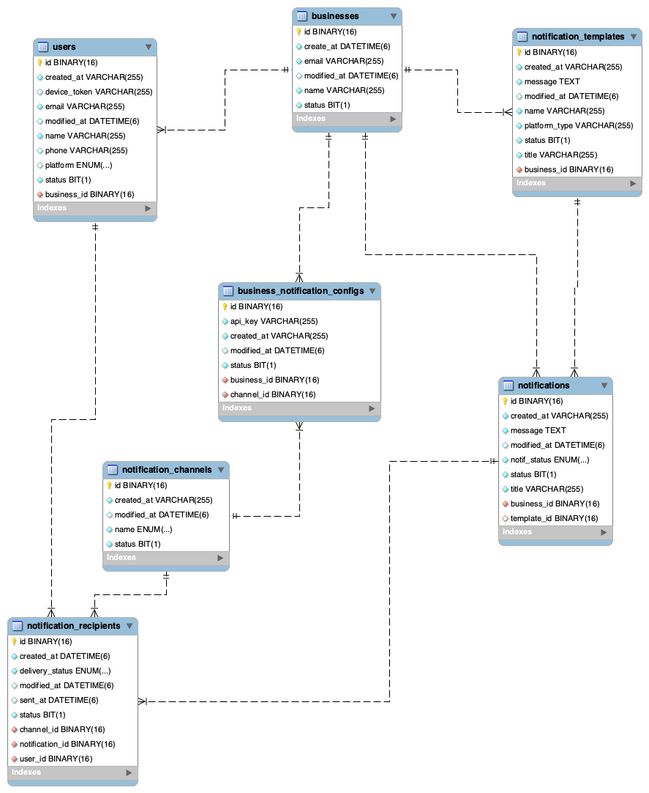

# Notification Service

This is a **Spring Boot-based Notification Service** that allows businesses to send notifications via **Email, SMS, iOS (APNS), and Android (FCM).**  

## Features
- Multi-Channel Notifications: **Email, SMS, Push (iOS & Android)**
- Business Platform Integration
- User-Specific Notifications & Templates
- Configurable Notification Channels  

## Database Structure

## Tech Stack
- **Java 17**
- **Spring Boot**
- **Spring JPA (Hibernate)**
- **MySQL**
- **Lombok**  
